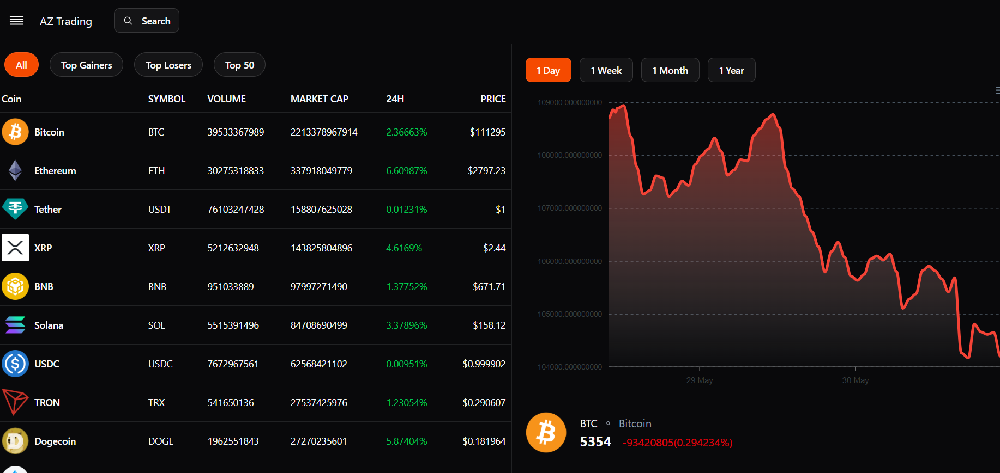
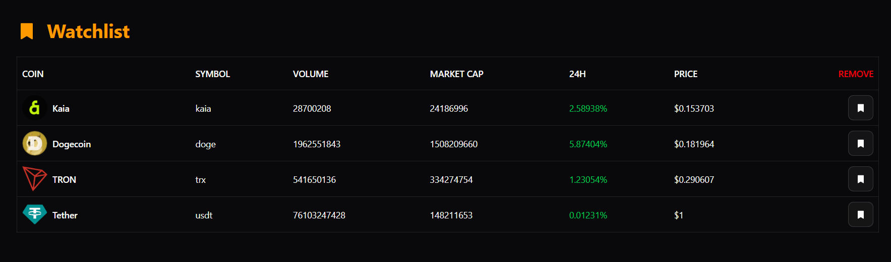
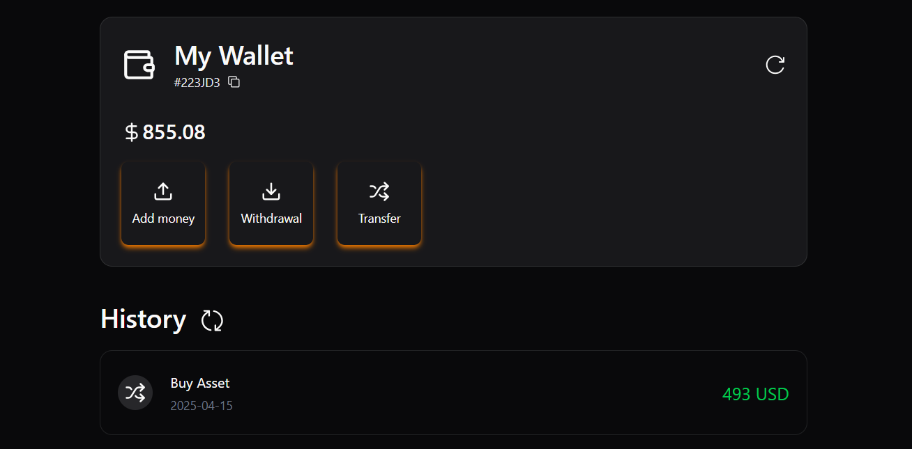
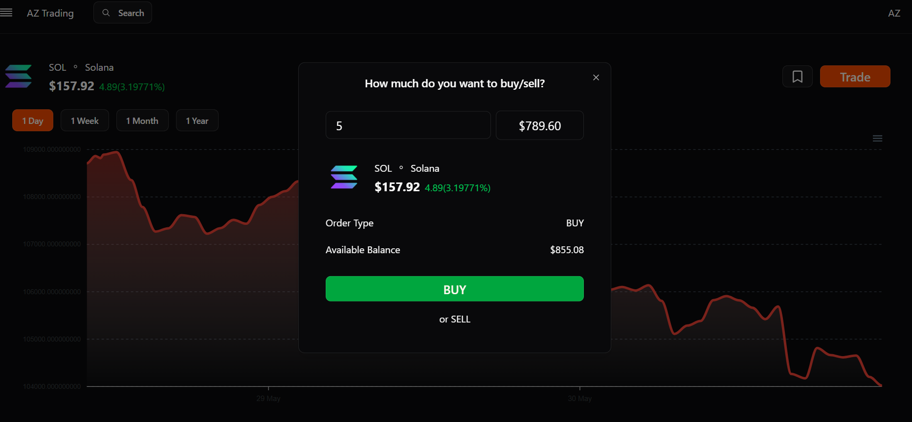
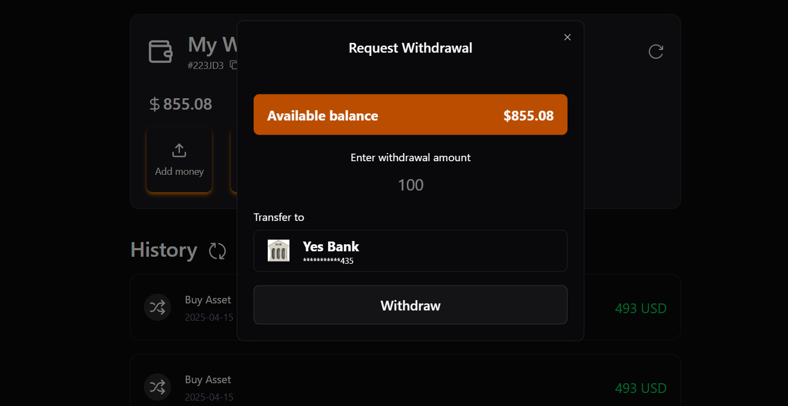
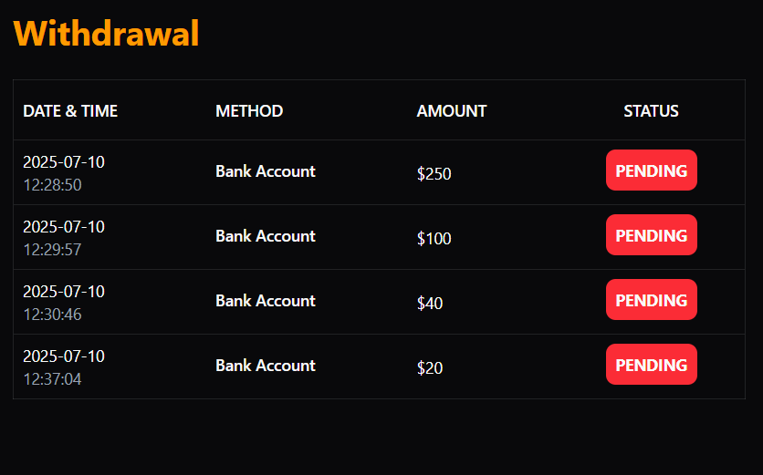
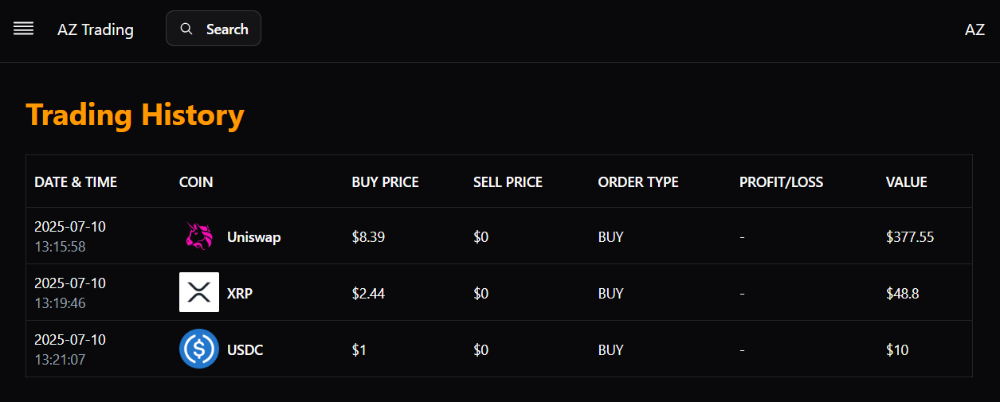

# 🪙 RealTimeTrading - Crypto Trading Platform

A full-stack coin trading web application that enables users to view real-time crypto data, manage portfolios, buy/sell assets, and maintain a watchlist — built using **React**, **Redux**, **Spring Boot**, and **MySQL**.

---

## 🚀 Features

### 🔐 Authentication

- Secure user registration & login with JWT-based authentication
- OTP verification support for signup/login
- Password reset via email OTP

### 📊 Coin Dashboard

- Real-time coin data from CoinGecko API
- Price charts with interactive graphs
- Coin filtering and search functionality

### 🧾 Trading System

- Buy and Sell coins with dynamic pricing
- Transaction history and activity log

### 💼 Wallet & Portfolio

- Wallet balance and asset overview
- Aggregated stats on holdings

### 📝 Watchlist

- Add/remove coins from personalized watchlist
- Quick access to tracked coins

---

## ⚙️ Tech Stack

| Frontend         | Backend               | Database | Others                 |
| ---------------- | --------------------- | -------- | ---------------------- |
| React + Vite     | Java Spring Boot      | MySQL    | Redux, Tailwind CSS    |
| React Router DOM | Spring Security + JWT |          | Radix UI, Lucide Icons |

---

## 🧪 API Documentation

- A full Postman collection for backend testing is included in the repo.

📁 File: [`TradingPlatform.postman_collection.json`](./TradingPlatform.postman_collection.json)

**Main Endpoints:**

- `POST /auth/register` – Register user
- `POST /auth/authenticate` – Login
- `POST /auth/verify-otp` – OTP verification
- `GET /coins` – List of coins (with pagination/filter)
- `GET /coins/:id/chart` – Get chart data by coin ID
- `GET /wallet` – Get user wallet
- `POST /orders` – Buy/Sell asset
- `GET /watchlist` – Get user's watchlist
- `POST /watchlist/:coinId` – Toggle coin in watchlist

---

## 🛠️ Getting Started

### 1. Clone the repository

```bash
git clone https://github.com/Devansh-ds/RealTimeTrading.git
cd RealTimeTrading
```

### 2. Start Backend (Spring Boot)

- Ensure MySQL is running
- Update `application.properties` with DB credentials
- Run `TradingApplication.java` from your IDE or via Maven:

```bash
./mvnw spring-boot:run
```

### 3. Start Frontend (React)

```bash
cd frontend
npm install
npm run dev
```

---

## 📸 Screenshots

### Dashboard  


### Watchlist  


### Wallet  


### Buy/Sell  


### Withdrawal  


### Withdrawal History  


### Trading History  



---

## 📂 Folder Structure

```plaintext
├── backend
│   ├── src/main/java/com/devansh/trading
│   └── ... Spring Boot Application
├── frontend
│   ├── src/pages
│   ├── src/state
│   └── ...
├── TradingPlatform.postman_collection.json
```

---

## 🙌 Contributing

Feel free to fork this repository and submit PRs. Feedback and improvements are welcome!

---

## 📬 Contact

**Devansh Singla**
[GitHub](https://github.com/Devansh-ds) | [LinkedIn](https://www.linkedin.com/in/devansh-singla-9a574b260/)

---

## 📄 License

This project is open-sourced under the MIT License.
